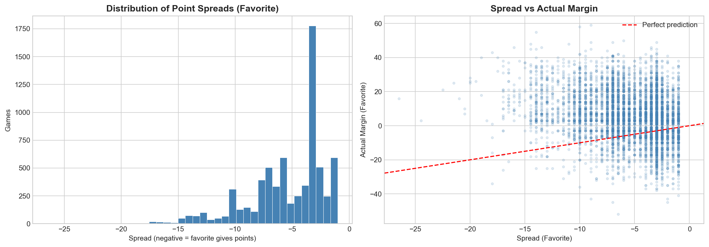
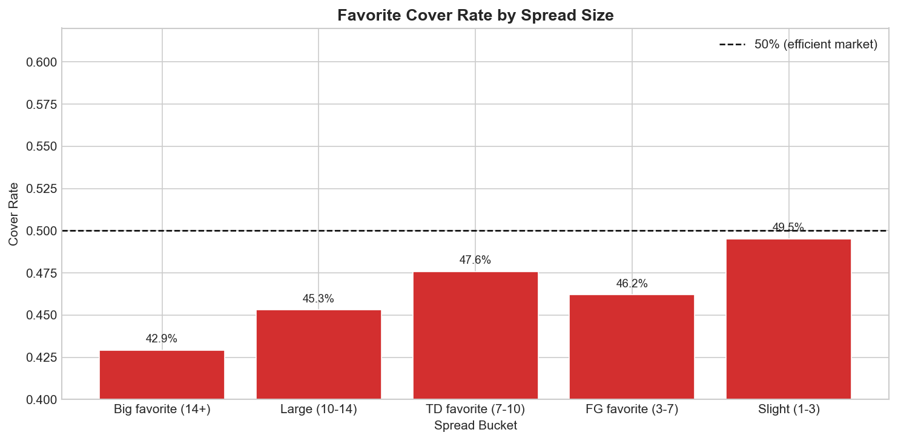
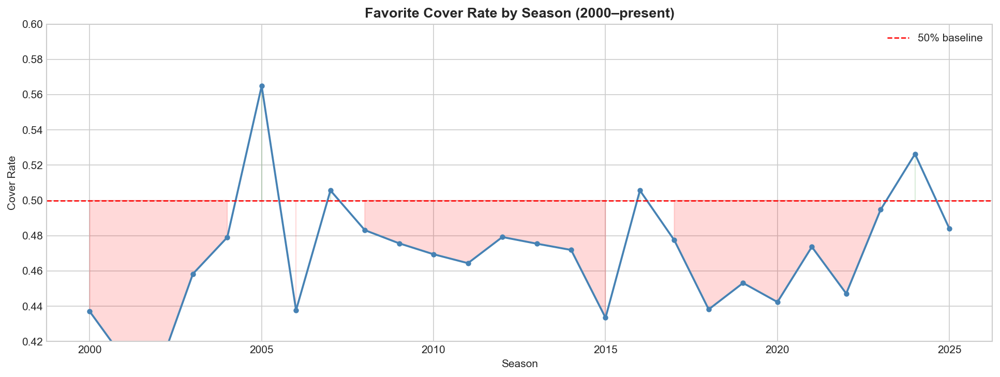
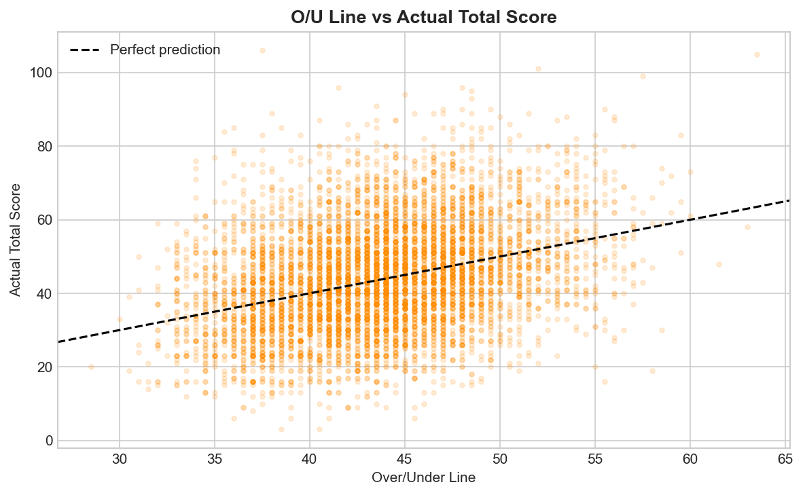
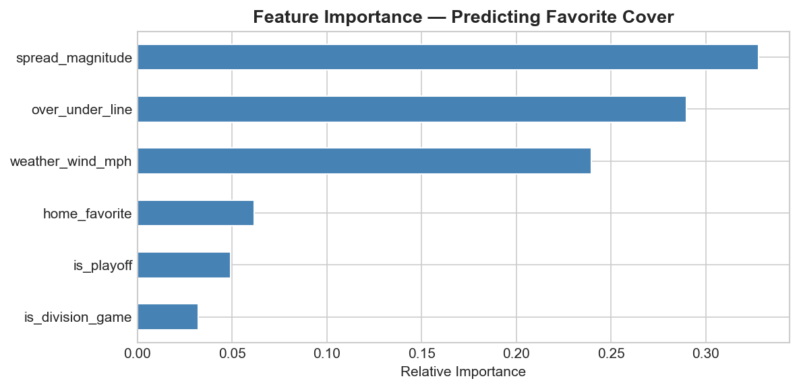
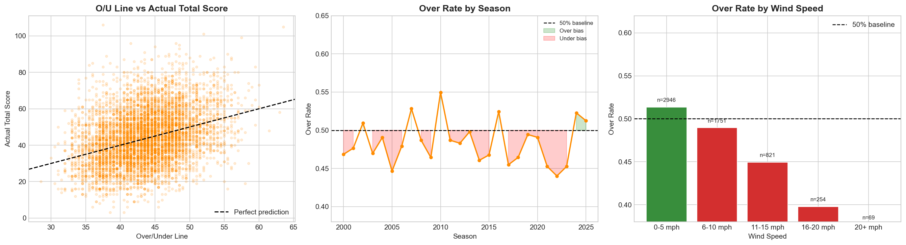

# NFL Spread & Over/Under Market Efficiency Analysis

Analyzing 6,971 NFL games from 2000-2025 to assess how efficiently the betting market prices point spreads and totals. Built using Python with a focus on quantitative reasoning, feature engineering, and predictive modeling.

## Key Findings
- Favorites covered the spread only 46.9% of the time: There is a statistically significant bias (p < 0.0001) for the underdog, though insufficient to exploit profitably after standard vig (-110 odds).
- The over/under market appears more efficient than the spread market: The actual totals in the game are more symmetrically distributed around the pregame O/U line.
- Wind speed is an undervalued factor in totals: Games where the wind is above 15 mph result in low scoring games, very often going under the O/U pregame line. It is a small sample size and would need further research.
- Logistic regression and random forest models achieved 52.9% and 52.8% cross-validation accuracy: It's very difficult to beat the market most of the time but there are small gaps it can be done.

## Visualizations

### Spread Distribution & Spread vs Actual Margin

### Cover Rate by Spread Size

### Cover Rate by Season

### Over/Under vs Actual Total

### Feature Importance

### Over/Under Analysis

---

## Why the Edge Isn't Exploitable

Even with a statistically significant underdog bias, three factors prevent long-term profit:

1. The vig: Standard -110 odds require 52.4% accuracy to break even. The underdog cover rate of 53.1% leaves almost no margin.
2. Market correction: When sharp money fades the favorites, books will adjust the lines lines, getting rid of the edge in real time.
3. No opening/closing line data: This dataset only contains one spread for each game. There isn't an opening and closing line. True edge is measured by closing line value.

## Methodology

### Data Preparation
- Filtered to 2000-2025 (modern betting era), removing pre-2000 games where market structure differed significantly
- Built a team name mapping dictionary to handle franchise relocations and rebrands (Washington Redskins, Washington Football Team, Washington Commanders, etc.)
- Dropped 46 pick'em games (<1% of data) where no spread existed

### Feature Engineering

- `spread_magnitude`- Absolute value of the spread, shows how uneven the matchup is
- `home_favorite`- Binary feature, indicates if favorite has home field advantage
- `is_playoff`- Binary feature, indicates if it is a regular season or playoff game
- `is_division_game`- Binary feature, indicates if a game is a divisional matchup
- `over_line`- Binary feature, indicates if the game went over the O/U line set pregame
- `margin`- Calculated the margin of the game
- `favorite_cover`- Binary feature, indicates if the favorite covered the spread (target feature)

- `total_score` and `over_line` were excluded from modeling due to target leakage. These features are both derived from the final score, information unavailable at the time the bet was placed.

### Models
- Logistic Regression
- Random Forest
- 5-fold cross-validation on all models

## Data Source

[NFL Scores and Betting Data — Kaggle](https://www.kaggle.com/datasets/tobycrabtree/nfl-scores-and-betting-data)

## Limitations & Future Work

- No opening/closing line: Adding both lines would allow us to view closing line value analysis.
- No injury data: Injuries are among the most impactful variables for line movement.
- No rest/travel data: Short-week games (Thursday Night Football) and teams with unfavorable travel schedules can effect team performance.
- Static historical analysis: Real-time odds would be needed in the future to allow for live bets to exploit these markets.
